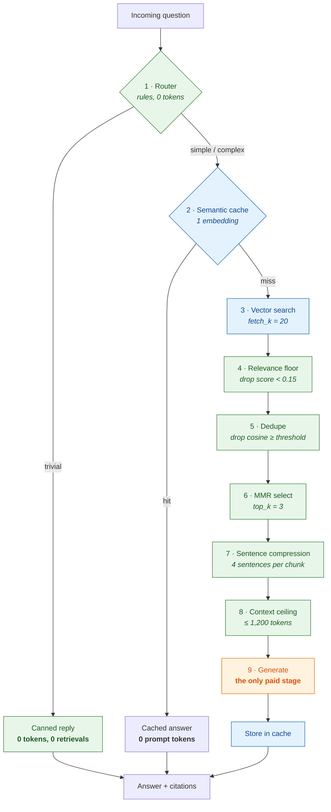
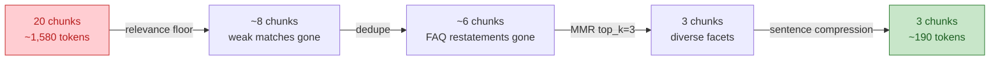
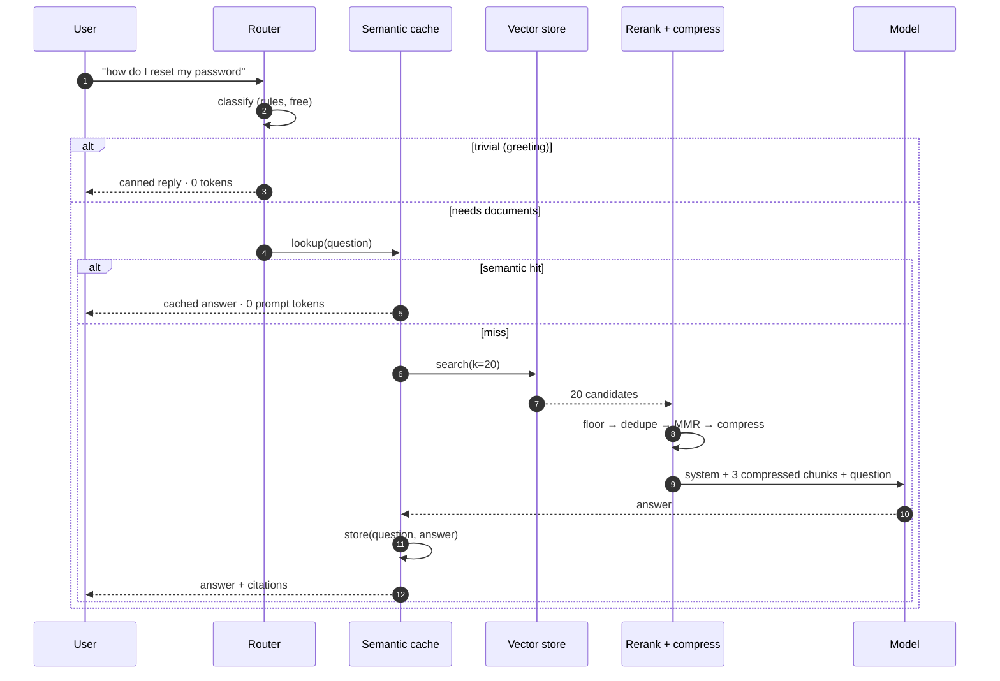
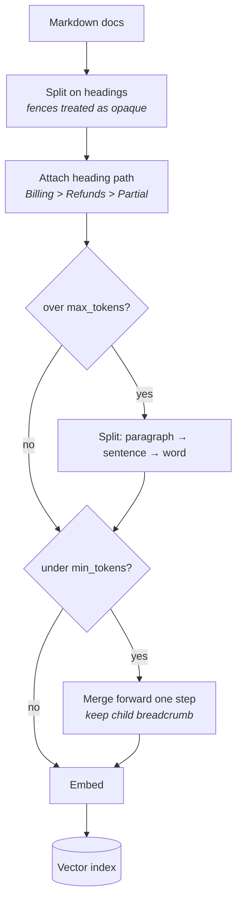
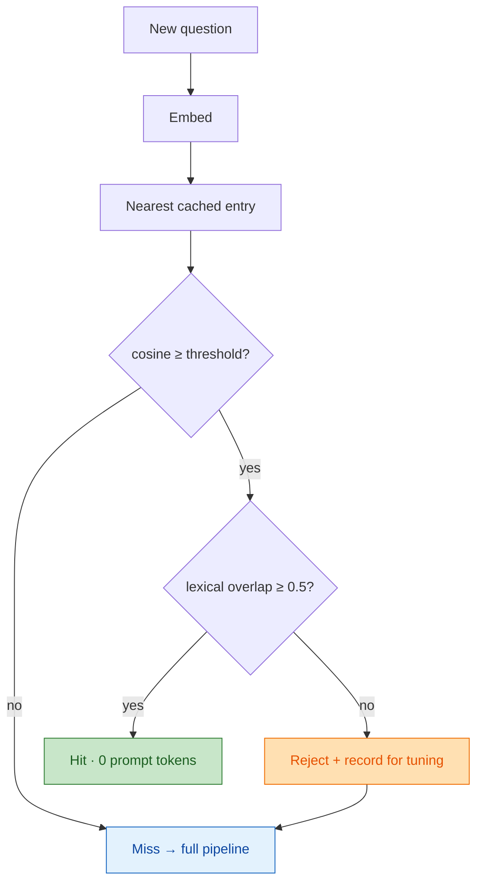

# RAG Support Bot

A documentation Q&A bot built around one question: **how few tokens can you spend
and still answer correctly?**

It answers from a markdown docs corpus with citations, and sends the model **88%
fewer prompt tokens** than a conventional top-20-chunks implementation — without
losing answers, which the test suite enforces.

```
traffic: 25 queries

configuration               tokens  vs naive  retrievals   cost of removing
---------------------------------------------------------------------------
naive (top-20 raw)          40,076        --          25                 --
all levers on                4,827     88.0%          17                 --
---------------------------------------------------------------------------
top_k=10 instead of 3        6,442     83.9%          17        +33% tokens
no semantic cache            5,511     86.2%          20        +14% tokens
no relevance floor           5,338     86.7%          17        +11% tokens
no sentence compression      5,186     87.1%          17         +7% tokens
no dedupe/MMR                4,862     87.9%          17         +1% tokens
no routing                   4,827     88.0%          22      +5 retrievals
no context ceiling           4,827     88.0%          17         negligible
```

Reproduce it — **no API key needed**, the whole pipeline runs offline:

```bash
pip install tiktoken
python benchmarks/ablation.py
```

---

## Architecture

Every stage is cheaper than the stage after it. Traffic is filtered by the cheap
stages so generation — the only stage billed at model rates — sees as little as
possible.



Green costs nothing. Blue costs one embedding. Orange is the only stage billed at
generation rates.

### Where the tokens go

Each filter removes a different *class* of waste, which is why they compose
rather than duplicate each other.



### Request lifecycle



### Ingestion

Chunk quality decides how few chunks retrieval can get away with. Fixed-size
chunking splits mid-sentence and strips the heading that says what the section is
even about — so you retrieve more chunks to compensate, paying tokens to undo
your own damage. Heading-aware chunks carry a breadcrumb and are self-describing,
which is what lets `top_k` stay at 3.



### The two-signal cache gate

The semantic cache is the highest-yield lever and the most dangerous one.



Embeddings alone rate *"what is the default rate limit"* and *"how do I raise my
rate limit"* at **0.577** cosine — same topic, different answers — while a genuine
paraphrase pair scores **0.408**. No single threshold separates them, so a second
independent signal is required. `test_lexical_gate_rejects_high_embedding_similarity`
pins it.

---

## Usage

```bash
pip install -r requirements.txt

python ask.py "how do I request a partial refund?"
python ask.py --explain "what is the rate limit?"   # show the funnel
python ask.py --interactive
python ask.py --online "..."                        # real embeddings + generation
```

`--explain` prints what each stage removed:

```
Q: how do I request a partial refund on an annual plan?
  route          simple  (single factual lookup)
  model tier     cheap
  fetched        20 chunks / 1,483 tokens
  after rerank   3 chunks
                 0.515  faq.md#Frequently asked questions > Can I get a partial refund?
                 0.482  billing.md#Billing > Refunds > Partial refunds

[route=simple tokens=239 vs naive 1,588 (85% saved)]
```

Point it at your own docs with `--corpus path/to/markdown`.

---

## The levers

| # | Lever | Module | Idea |
|---|---|---|---|
| 1 | **Query routing** | `router.py` | Greetings never touch the index. Rules, not a model — paying an LLM to decide whether to pay an LLM eats the saving. |
| 2 | **Semantic caching** | `cache.py` | Nobody phrases a question the same way twice. Match on embedding similarity, gated by lexical overlap. |
| 3 | **Relevance floor** | `rerank.py` | Never pad to `top_k` with noise. This is what enables an honest "not in the docs". |
| 4 | **Dedupe + MMR** | `rerank.py` | Kill restatements, then pick for coverage rather than raw score — three facets instead of three phrasings of one. |
| 5 | **Sentence compression** | `compress.py` | Keep the 4 best sentences per chunk, in document order. Reordering by score shreds numbered procedures. |
| 6 | **Model routing** | `router.py` | Factual lookups go to the cheap model; comparative and causal questions escalate. |

---

## Calibration is backend-specific

Thresholds are a property of the embedding model, not the algorithm:

| Threshold | Trained model | Hashing fallback |
|---|---|---|
| Cache hit | 0.93 | 0.72 |
| Dedupe | 0.92 | 0.70 |

Reusing trained-model numbers offline silently turns dedupe into a no-op and
drives cache hits to zero — failures that look like "the feature does nothing"
rather than an error. Selection is automatic, keyed on the embedding's
`is_approximate` attribute, and pinned by `test_dedupe_threshold_is_backend_aware`.

---

## Testing

```bash
pytest                           # 43 tests, offline, no network
python benchmarks/compare.py     # naive vs optimized
python benchmarks/ablation.py    # per-lever contribution
```

The fidelity tests matter more than the token counts — cutting tokens is trivial
if you may also cut the right chunk. See [docs/evaluation.md](docs/evaluation.md).

---

## Azure deployment

For production deployments the bot maps onto Azure managed services with no code
changes — only environment variable swaps:

| Local component | Azure equivalent |
|---|---|
| OpenAI API | Azure OpenAI Service (private VNet, compliance) |
| In-memory vector store | Azure AI Search (hybrid keyword + vector) |
| In-memory semantic cache | Azure Cache for Redis (HNSW vector index) |
| Local corpus `*.md` | Azure Blob Storage |
| CLI ingestion | Azure Functions (Event Grid trigger) |
| — | Azure Container Apps (bot hosting) |
| — | Azure API Management (auth, rate limiting) |

### Cost savings at scale

The 88% token reduction translates directly to AI generation cost. Based on
Azure OpenAI pricing ($2.50/M GPT-4o input, $0.15/M GPT-4o-mini input):

| Deployment size | Naive cost/mo | Optimized cost/mo | Saving |
|---|---|---|---|
| 2,000 queries/day | $241 | $2.44 | **99%** |
| 10,000 queries/day | $1,208 | $12.15 | **99%** |
| 50,000 queries/day | $6,039 | $60.70 | **99%** |

Azure infrastructure (AI Search + Redis + Container Apps + APIM) adds a fixed
~$160/month. At 2,000 queries/day the total bill drops from **$401/mo to
$162/mo** (60% reduction); at 10,000 queries/day it drops from **$1,368/mo to
$172/mo** (87% reduction).

See **[docs/azure-architecture.md](docs/azure-architecture.md)** for the full
solution diagram, request flow, ingestion pipeline, and per-lever cost breakdown.

---

## Documentation

* **[docs/azure-architecture.md](docs/azure-architecture.md)** — Azure solution diagram, cost analysis, infrastructure sizing
* **[docs/architecture.md](docs/architecture.md)** — full design, all diagrams, module map
* **[docs/tuning.md](docs/tuning.md)** — every knob, what it trades, how to find the floor
* **[docs/evaluation.md](docs/evaluation.md)** — how the numbers are measured and what they mean

---

## Caveats

* The offline hashing embedding is a bag of words. It caps the offline cache hit
  rate near 15%; a trained embedding does materially better on loose paraphrases.
* Token counts use `tiktoken` (`cl100k_base`) with a 4-chars-per-token fallback —
  good for ratios, not for billing.
* The demo corpus is four documents. Dedupe and MMR get *more* valuable as a
  corpus grows and accumulates restatements.
