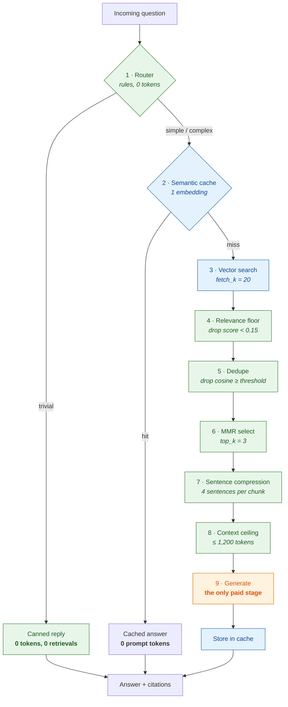
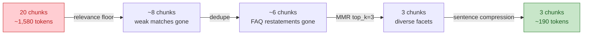
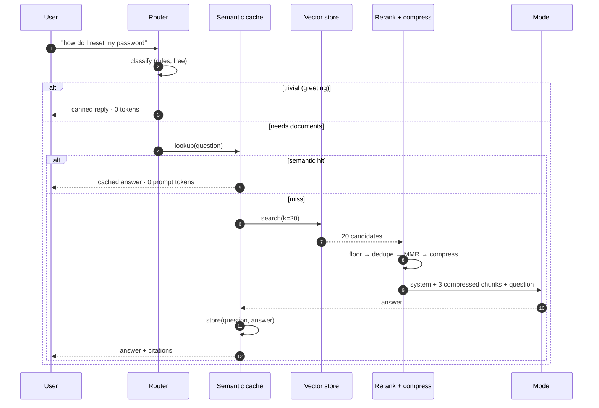
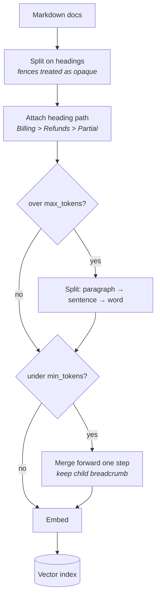
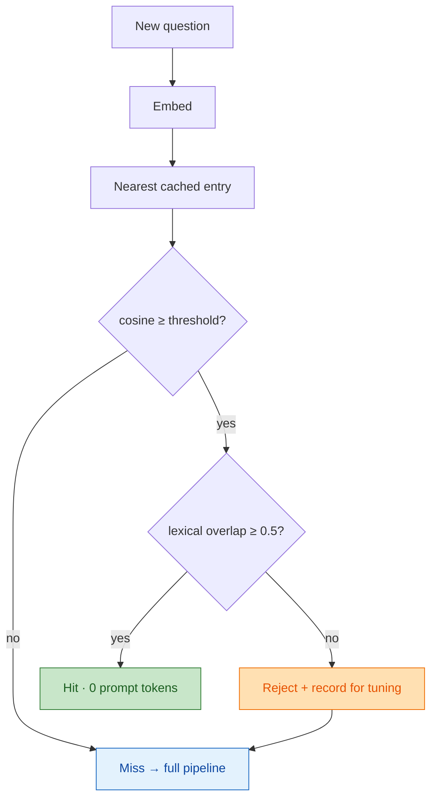

# Architecture

## Design premise

Every stage in this pipeline is cheaper than the stage after it. Traffic is
filtered by the cheap stages so the expensive one — generation — only ever sees
what genuinely needs it, and sees as little of it as possible.

Green stages cost nothing, blue stages cost an embedding, orange is the only
stage billed at generation rates.

## Where the tokens go

Naive RAG sends 20 raw chunks. Each filter removes a different *class* of waste,
which is why they compose rather than overlap completely.

## Request lifecycle

## Ingestion

Chunk quality decides how few chunks retrieval can get away with. Fixed-size
chunking forces you to retrieve more to compensate; structure-aware chunking
with heading breadcrumbs makes a single chunk self-describing.

### Why merge forward, and only once

A stub section (`## Overview` with one sentence) is noise alone but useful glued
to what it introduces. Two rules keep that honest:

* **Forward, not backward** — the following chunk's heading path is the more
  specific of the two. Merging backward would relabel a nested section with its
  parent's breadcrumb.
* **One step only** — without a cap, a document whose sections are all short
  cascades into a single chunk carrying the deepest breadcrumb, a label that is
  false for most of its content. `test_all_short_document_does_not_collapse_to_one_chunk`
  pins this.

## The two-signal cache gate

The semantic cache is the highest-yield lever and the most dangerous one. A false
hit answers the customer's question with someone else's answer, confidently.

Embeddings alone rate *"what is the default rate limit"* and *"how do I raise my
rate limit"* at **0.577** cosine — the same topic with different answers — while a
genuine paraphrase pair scores **0.408**. No single threshold separates them, so
a second, independent signal is required. Requiring lexical agreement too trades
hit rate for safety, which is the correct direction when the failure is silent.

## Module map

| Module | Lever | Cost |
|---|---|---|
| `router.py` | Skip retrieval; pick model tier | free (rules) |
| `cache.py` | Semantic cache, two-signal gate | 1 embedding |
| `chunking.py` | Structure-aware, self-describing chunks | ingest-time |
| `store.py` | Vector search | 1 embedding |
| `rerank.py` | Relevance floor, dedupe, MMR | vector math |
| `compress.py` | Sentence extraction, context ceiling | vector math |
| `pipeline.py` | Orchestration and accounting | — |

## Calibration is backend-specific

Thresholds are a property of the embedding model, not of the algorithm. This
repo ships a deterministic hashing embedding so everything runs offline, and its
similarity distribution is nothing like a trained model's:

| Threshold | Trained model | Hashing fallback |
|---|---|---|
| Cache hit | 0.93 | 0.72 |
| Dedupe | 0.92 | 0.70 |

Reusing the trained-model numbers offline silently turns dedupe into a no-op and
drives the cache hit rate to zero — failures that look like "the feature does
nothing" rather than an error. `RetrievalBudget.dedupe_for()` and
`SemanticCache.__init__` select by backend, and
`test_dedupe_threshold_is_backend_aware` pins it.
