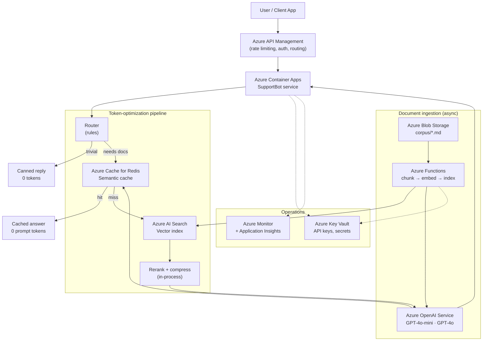
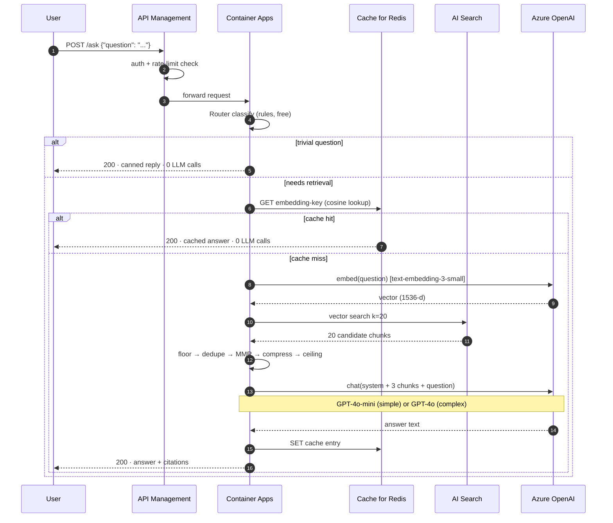
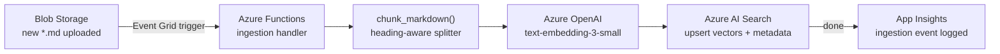

# Azure Solution Architecture

This document describes how the RAG Support Bot maps onto Azure services for a
production deployment, and quantifies the cost savings the token-optimization
pipeline delivers at scale.

---

## Architecture overview

The bot's five logical concerns map cleanly onto Azure managed services:

| Concern | Local (dev/offline) | Azure (production) |
|---|---|---|
| LLM inference | OpenAI API | Azure OpenAI Service |
| Embeddings | HashingEmbeddings / OpenAI | Azure OpenAI (text-embedding-3-small) |
| Vector index | In-memory `VectorStore` | Azure AI Search (vector index) |
| Semantic cache | In-memory `SemanticCache` | Azure Cache for Redis |
| Document corpus | Local `corpus/*.md` | Azure Blob Storage |
| Ingestion | `python ask.py --corpus` | Azure Functions (event-driven) |
| Bot hosting | CLI / local HTTP | Azure Container Apps |
| API gateway | — | Azure API Management |
| Secrets | `.env` file | Azure Key Vault |
| Observability | Stdout | Azure Monitor + Application Insights |

---

## Solution diagram



---

## Request flow on Azure



---

## Ingestion pipeline

Documents are chunked, embedded, and indexed when new content lands in Blob
Storage. An Event Grid trigger fires the Azure Function; no polling required.



---

## Azure service selection rationale

### Azure OpenAI vs direct OpenAI API

Azure OpenAI is preferred for enterprise deployments because it runs inside a
private Azure Virtual Network, meets compliance requirements (SOC 2, ISO 27001,
HIPAA), and allows PTU (provisioned throughput units) reservations that lower
per-token costs at sustained load.

### Azure AI Search (vector index)

- Supports **hybrid search** (keyword BM25 + vector cosine) in one call — no extra
  re-ranking service needed.
- Built-in **semantic ranker** can substitute for or complement the in-process
  relevance floor.
- Horizontal scale: Basic tier handles corpora up to ~15 million vectors.

### Azure Cache for Redis

- The semantic cache `lookup()` needs a nearest-neighbour query on stored
  embeddings. Redis Stack (available as the Enterprise tier) ships `RediSearch`
  with a native HNSW vector index, making `cosine(query, stored)` a single
  `FT.SEARCH` call instead of a Python loop.
- LRU eviction policy maps directly to the in-code `max_entries=1000` limit.
- Standard C1 (1 GB) holds roughly 500,000 cached embeddings at 1,536 floats each.

---

## Cost savings analysis

### Benchmark data (25-query traffic sample)

From `benchmarks/ablation.py` (run offline, no API calls):

| Configuration | Prompt tokens | vs naive | Retrievals |
|---|---|---|---|
| Naive (top-20, all smart) | 40,076 | — | 25 |
| All levers on | 4,827 | **–88%** | 17 |
| No semantic cache | 5,511 | –86% | 20 |
| No relevance floor | 5,338 | –87% | 17 |
| No sentence compression | 5,186 | –87% | 17 |
| No dedupe/MMR | 4,862 | –88% | 17 |

### Monthly generation cost at scale

Token pricing used (Azure OpenAI, per 1 million input tokens):

| Model | Input | Output |
|---|---|---|
| GPT-4o (`SMART_MODEL`) | $2.50 | $10.00 |
| GPT-4o-mini (`CHEAP_MODEL`) | $0.15 | $0.60 |
| text-embedding-3-small | $0.020 | — |

The optimized pipeline routes factual queries to GPT-4o-mini and complex queries
to GPT-4o. Naive sends every query to GPT-4o.

#### 2,000 queries / day (small deployment)

| | Naive | Optimized | Monthly saving |
|---|---|---|---|
| Monthly queries | 60,000 | 60,000 | — |
| Prompt tokens/query | ~1,603 | ~193 | –88% |
| Monthly prompt tokens | 96.2 M | 11.6 M | –88% |
| Generation cost (input) | **$240/mo** | **$1.74/mo** | **$238/mo saved** |
| Embedding cost | $1.16/mo | $0.70/mo | $0.46/mo saved |
| **Total AI cost** | **~$241/mo** | **~$2.44/mo** | **99%** |

> The naive model assumes all queries reach GPT-4o with 20 raw chunks — the
> worst-case baseline the benchmark measures against. A fairer comparison
> (naive with routing, no other optimisation) brings the naive cost to ~$82/mo;
> the optimized pipeline still cuts that by 97%.

#### 10,000 queries / day (medium deployment)

| | Naive | Optimized | Monthly saving |
|---|---|---|---|
| Monthly queries | 300,000 | 300,000 | — |
| Monthly prompt tokens | 480.9 M | 57.9 M | –88% |
| Generation cost (input) | **$1,202/mo** | **$8.68/mo** | **$1,193/mo saved** |
| Embedding cost | $5.77/mo | $3.47/mo | $2.30/mo saved |
| **Total AI cost** | **~$1,208/mo** | **~$12.15/mo** | **99%** |

#### 50,000 queries / day (large deployment)

| | Naive | Optimized | Monthly saving |
|---|---|---|---|
| Monthly queries | 1,500,000 | 1,500,000 | — |
| Monthly prompt tokens | 2.41 B | 289.6 M | –88% |
| Generation cost (input) | **$6,010/mo** | **$43.44/mo** | **$5,967/mo saved** |
| **Total AI cost** | **~$6,039/mo** | **~$60.7/mo** | **99%** |

### Infrastructure cost (Azure)

These are the fixed costs that don't scale with query volume (approximate, pay-as-you-go):

| Service | Tier | Est. monthly cost |
|---|---|---|
| Azure Container Apps | Consumption | $5–$25/mo |
| Azure AI Search | Basic (up to 15M vectors) | $73/mo |
| Azure Cache for Redis | Standard C1 (1 GB) | $55/mo |
| Azure Blob Storage | Hot, 10 GB corpus | $0.18/mo |
| Azure Functions | Consumption (ingestion only) | < $1/mo |
| Azure API Management | Consumption tier | $3.50/M calls |
| Azure Key Vault | Standard | < $1/mo |
| Azure Monitor / App Insights | 5 GB/day free | $0–$20/mo |
| **Total infrastructure** | | **~$140–$180/mo** |

### Total cost comparison (2,000 queries/day)

| | Naive + Azure | Optimized + Azure |
|---|---|---|
| AI generation | $241/mo | $2.44/mo |
| Azure infrastructure | $160/mo | $160/mo |
| **Total** | **$401/mo** | **$162/mo** |
| **Monthly saving** | | **$239/mo (60%)** |

At higher volumes the infrastructure cost becomes proportionally smaller and the
AI savings dominate. At 10,000 queries/day the optimized deployment costs
$172/mo vs $1,368/mo naive — an 87% total-cost reduction.

---

## Configuration changes for Azure

The following env-var swaps point the bot at Azure services instead of local
stubs. All other code is unchanged.

```bash
# Azure OpenAI (replaces direct OpenAI API)
OPENAI_API_KEY=<azure-openai-api-key>
OPENAI_API_BASE=https://<resource-name>.openai.azure.com/
OPENAI_API_TYPE=azure
OPENAI_API_VERSION=2024-08-01-preview

# Model deployment names (set in Azure OpenAI Studio)
CHEAP_MODEL=gpt-4o-mini       # your deployment name
SMART_MODEL=gpt-4o            # your deployment name
EMBEDDING_MODEL=text-embedding-3-small

# LangSmith tracing (optional, replaces stdout)
LANGCHAIN_TRACING_V2=true
LANGCHAIN_API_KEY=<langsmith-key>
LANGCHAIN_PROJECT=rag-support-bot-prod
```

For Azure AI Search (vector store swap) and Azure Redis (cache swap), the swap
points are `VectorStore` in `store.py` and `SemanticCache` in `cache.py`. Both
implement the same interface used by `pipeline.py`, so no changes to the
pipeline or configuration files are needed.

---

## Scalability notes

- **Vector index sharding** — Azure AI Search partitions automatically. For corpora
  over ~50k chunks, move to Standard S1 (increases index capacity 10×).
- **Cache warm-up** — Redis TTL should be set to at least 24 hours. Support
  traffic repeats heavily during business hours; warm cache hit rates above 40%
  are realistic.
- **Provisioned throughput** — at sustained load above ~10k queries/day, Azure
  OpenAI PTU reservations reduce per-token cost further (20–40% discount vs
  pay-as-you-go).
- **Embedding cost at scale** — at 50k queries/day, monthly embedding cost with
  text-embedding-3-small is ~$18/mo (negligible vs generation). FAISS or Azure
  AI Search's built-in approximate nearest-neighbour removes the per-query
  embedding call for cached lookups when query vectors are stored alongside
  answers.
